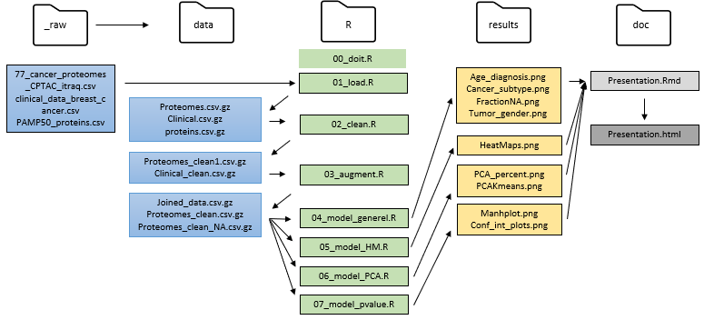

```{r Install, include=FALSE}
library("tidyverse")
library("usethis")
library("devtools")
library("patchwork")
library(modelr)
options(na.action = na.warn)
library(lubridate)
library(broom)
library(purrr)
library(vroom)
library(stringr)
library(kableExtra)
```

```{r load of model generel to be used in introduction, include=FALSE} 
setwd('../')
source(file = "R/04_model_generel.R", local = knitr::knit_global())
```

# Introduction 
## Overview of data
- Plots and other analysis of the data. 
- **File**: 77_cancer_proteomes_CPTAC_itraq.csv
  - Gene expression data from 77 cancer patients and 3 healthy persons.
- **File**: clinical_data_breast_cancer.csv
  - Clinical data from the 77 cancer patients
  
[Source: Kaggle](https://www.kaggle.com/piotrgrabo/breastcancerproteomes#clinical_data_breast_cancer.csv)  

## Github overview
#

# Materials and methods
## Materials: Extract of raw data
```{r load raw data, include=FALSE}
setwd('../')
source(file = "R/01_load.R", knitr::knit_global())
```

**Proteomes**
```{r show raw data proteomes, echo=FALSE}
set.seed(77777) #added to ensure same slice_sample choose the same 4 rows each time.
proteomes %>%
  select(1:4) %>%
  slice_sample(n =4) %>%
  kable("html") %>%
  kable_styling(font_size = 10)
```

**Clinical**
```{r show raw data clinical, echo=FALSE}
set.seed(77777) #added to ensure same slice_sample choose the same 4 rows each time.
clinical %>%
  select(`Complete TCGA ID`, Gender, `Age at Initial Pathologic Diagnosis`, Tumor, `PAM50 mRNA`) %>% #add flere columns if relevant
  slice(1:4) %>%
  kable("html") %>%
  kable_styling(font_size = 10)
```


## Methods: Cleaning of data
### We have done some cleaning of the two data sets 
- **Proteomes**: 
  - Rename, so the column names align with the clinical file
  - Removing .01TCGA from every column name to match ID's in clinical using rename() in combination with str_replace_all()
  - Removing duplicates using select() 
  
- **Clinical**: 
  - Aligning ID's with proteome file using sub_str()


## Methods: Wrangle data
### After the cleaning, the datasets were wrangled and joined
- **Proteomes**: 
  - Removing fraction NA > 0.25 using filter()
  - Replace the remaining NAs with median of column
  - Transpose data (get RefSeqProteinID as columns)

- **Joining**:
  - Right_join by TCGA_IDs in proteomes file
    - 28 patients were dropped, 3 healthy patients
  - Age group, HER2 as binary, replace_na() in class


## Materials: Extract of clean data
```{r load clean data, include=FALSE}
setwd('../')
source(file = "R/03_augment.R", knitr::knit_global())
```

**Joined data**
```{r show clean data, echo=FALSE}
set.seed(759677) #added to ensure same slice_sample choose the same 4 rows each time.
joined_data %>%
  select(c(1:4,9,23)) %>%
  slice_sample(n =4) %>%
  kable("html") %>%
  kable_styling(font_size = 10)

joined_data %>%
  select(100:105) %>%
  slice_sample(n =4) %>%
  kable("html") %>%
  kable_styling(font_size = 10)
```

# Results
## Removal for genes according to the fraction of NAs
```{r load and plot FracNA, echo=FALSE, warning=FALSE, message=FALSE} 
setwd('../')
source(file = "R/04_model_generel.R", knitr::knit_global())

fractionNA_All + fractionNA_without0
```

## Age at diagnosis
```{r show Age at diagnosis, echo=FALSE}
age_diagnosis
```

## Tumor, age at diagnosis and gender
```{r show tumor gender and other relevant, echo=FALSE}
tumor_gender
```


## Subtype of breast cancer
```{r show Subtype of cancer, echo=FALSE}
cancer_subtype
```

## Extract relevant breast cancer genes
8 genes are selected \
- BRCA1 = \
- TP53 = \
- CHEK2 = \
- PTEN = \
- CDH1 = \
- STK11 = \
- ERRB2 = \
- GATA3 = \


## Heat map
```{r load file of Heatmap, include=FALSE} 
setwd('../')
source(file = "R/05_model_HM.R", local = knitr::knit_global())
```

Two Heat maps are plotted using geom_tile() on relevant Breasts Cancer Genes. One is based on tumor size whereas the other is based on class
```{r show HeatMap, echo=FALSE, warning=FALSE, message=FALSE}
HM_class + HM_TumorSize
```

## PCA percents
```{r load file of PCA, include=FALSE} 
setwd('../')
source(file = "R/06_model_PCA.R", local = knitr::knit_global())
```

```{r show PCA procents , echo=FALSE, warning=FALSE, message=FALSE}
PCA_percent
```

## PCA and K-means
Three plots of PCA, K-means org. data and K-means PCA data
```{r show PCA , echo=FALSE, warning=FALSE, message=FALSE}
(pl1 + pl2 + pl3) 
```

## Linear model extract
```{r load file of pvalues, include=FALSE} 
setwd('../')
source(file = "R/07_model_pvalue.R", local = knitr::knit_global())
```

```{r show extract of protoemes , echo=FALSE, warning=FALSE, message=FALSE}
set.seed(759677) #added to ensure same slice_sample choose the same 4 rows each time.
proteomes_func_sig %>%
  select(c(1,8:12)) %>%
  slice_sample(n =4) %>%
  kable("html") %>%
  kable_styling(font_size = 10)

```

## Manhattan plot
```{r show p value plot , echo=FALSE, warning=FALSE, message=FALSE}
manhplot
```

## Confidence interval plots
```{r show Conf int plots , echo=FALSE, warning=FALSE, message=FALSE}
conf_int + conf_int_sig 
```

# Discussion
## Fraction of Na
- Fraction of NA > 0.25 has been removed based on the plot showed in results. 
  - Calculated by
    - rowSums(is.na(select(.,-RefSeqProteinID)))/80)


## Selection of cancer_genes
### Interrogation of genes related to breast cancer \
BRCA1 = NP_009231 \
TP53 = NP_000537 \
CHEK2 = NP_009125, NP_665861 \
PTEN = NP_000305 \
CDH1 = NP_004351 \
STK11 = NP_000446 \
ERRB2/HER2 = NP_004439 \
GATA3 = NP_001002295 \

### Compare healthy and cancer diagnosed patients.
Only 3 healthy people.

## Protein data set
- Not useful
- Consists of Genesymbol, RefSeqProteinID, Species, Gene Name


# Thank you for listining. 