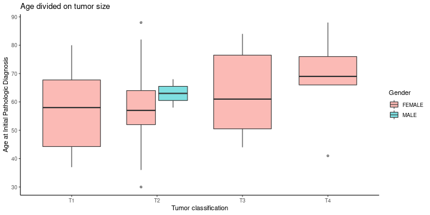
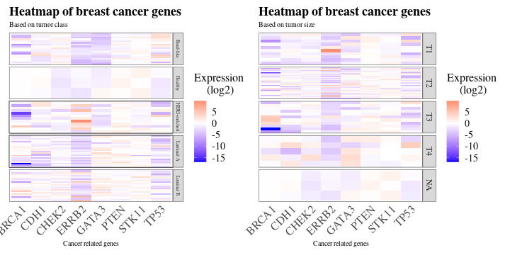
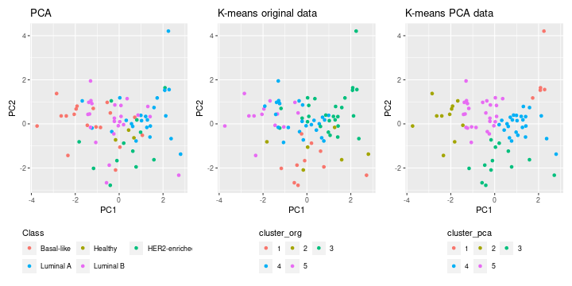
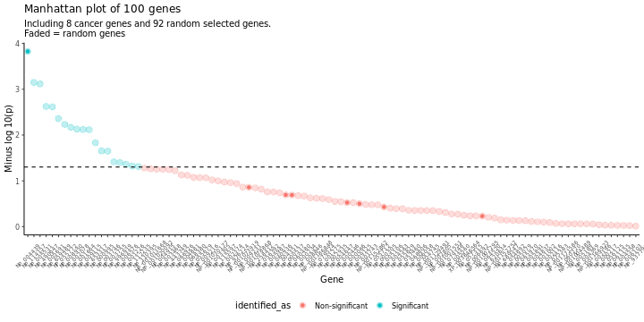

```{r Install, include=FALSE}
library("tidyverse")
library("usethis")
library("devtools")
library("patchwork")
library(modelr)
options(na.action = na.warn)
library(lubridate)
library(broom)
library(purrr)
library(vroom)
library(stringr)
library(kableExtra)
```

# Introduction 
## Overview of data
- **File**: 77_cancer_proteomes_CPTAC_itraq.csv
  - Gene expression data from 77 cancer patients and 3 healthy persons.
  
- **File**: clinical_data_breast_cancer.csv
  - Clinical data from the 77 cancer patients
  
[Source: Kaggle](https://www.kaggle.com/piotrgrabo/breastcancerproteomes#clinical_data_breast_cancer.csv)  

## Github overview


# Materials and methods
## Materials: Extract of raw data
```{r load raw data, include=FALSE}
setwd('../')
clinical <- read_csv(file = "data/clinical.csv.gz")
proteomes <- read_csv(file = "data/proteomes.csv.gz")
joined_data <- read_csv(file = "data/joined_data.csv.gz")
proteomes_statistics <- read_csv(file = "data/proteomes_statistics.csv.gz")
```

**Proteomes**
```{r show raw data proteomes, echo=FALSE}
set.seed(77777) #added to ensure same slice_sample choose the same 4 rows each time.
proteomes %>%
  select(1:4) %>%
  slice_sample(n =4) %>%
  kable("html") %>%
  kable_styling(font_size = 10)
```

**Clinical**
```{r show raw data clinical, echo=FALSE}
set.seed(77777) #added to ensure same slice_sample choose the same 4 rows each time.
clinical %>%
  select(`Complete TCGA ID`, Gender, `Age at Initial Pathologic Diagnosis`, Tumor, `PAM50 mRNA`) %>% #add flere columns if relevant
  slice(1:4) %>%
  kable("html") %>%
  kable_styling(font_size = 10)
```


## Methods: Cleaning of data
### We had to clean the data in order to use it for analysis 


## Methods: Wrangle data
### After the cleaning, the datasets were wrangled and joined
- **Proteomes**: 
  - Removing fraction NA > 0.25 using filter()
  - Replace the remaining NAs with median of column
  - Transpose data (get RefSeqProteinID as columns)

- **Joining**:
  - Right_join by TCGA_IDs in proteomes file
    - 28 patients were dropped, 3 healthy patients
  - Age group, HER2 as binary, replace_na() in class


## Materials: Extract of clean data

**Joined data**
```{r show clean data, echo=FALSE}
set.seed(759677) #added to ensure same slice_sample choose the same 4 rows each time.
joined_data %>%
  select(c(1:4,9,23)) %>%
  slice_sample(n =4) %>%
  kable("html") %>%
  kable_styling(font_size = 10)

joined_data %>%
  select(100:105) %>%
  slice_sample(n =4) %>%
  kable("html") %>%
  kable_styling(font_size = 10)
```

# Results
## Removal for genes according to the fraction of NAs


## Age at diagnosis


## Tumor, age at diagnosis and gender


## Subtype of breast cancer


## Extract relevant breast cancer genes
  | Gene     | Description |
  | --------- | -----:|
  | BRCA1       | breast cancer type 1 susceptibility protein isoform 2 |
  | TP53        |   cellular tumor antigen p53 isoform a  |
  | CHEK2       |    serine/threonine-protein kinase Chk2 isoform a |
  | PTEN        |    phosphatidylinositol 3,4,5-trisphosphate 3-phosphatase |
  | CDH1        |    cadherin-1 preproprotein |
  | STK11       |    serine/threonine-protein kinase STK11 |
  | ERRB2/HER2  |    receptor tyrosine-protein kinase erbB-2 isoform a precursor |
  | GATA3       |    trans-acting T-cell-specific transcription factor GATA-3 isoform 1 |
[Source: American Cancer Society](https://www.cancer.org/cancer/breast-cancer/risk-and-prevention/breast-cancer-risk-factors-you-cannot-change.html?fbclid=IwAR3_gy68xITNknN36n2uay179hfmhxMrP7UejZKIe5EgtE_1TFGVZQPnaKA)  

## Heat map



## PCA percent


## PCA and K-means


## Linear model extract
```{r show linear, echo=FALSE}
proteomes_statistics
```


## Manhattan plot


# Discussion
## Handling of NA values
- Limit at 25% ~ 17% genes removed \
- Limit at 0% ~ 36% genes removed \

### **Replacement by median**\
- Avoid NA values \
\
- Not necessary to remove either person or whole gene \
\
- Does not skew the data\


## Selection of cancer genes
- Small subset of data \
- Improvement for future: identify significant genes across whole dataset\
- Findings: HER2/ERRB2 gene significant in Manhattan plot


## Additional thoughts

### **Comparison between healthy and diseased** \
- Used in PCA analysis and K-means \
- Only 3 individuals (no clinical data) \
\

### **Deselection of dataset** \
- "Dictionary" of proteins \
- Not usefull for our approach \
- Could have been used to "translate" RefSeqProteinID's

# Thank you for listening.