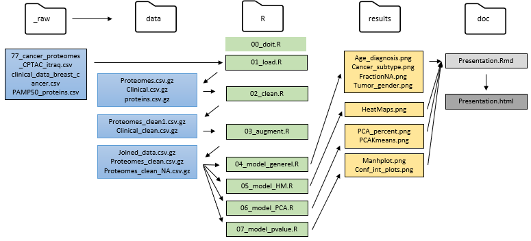
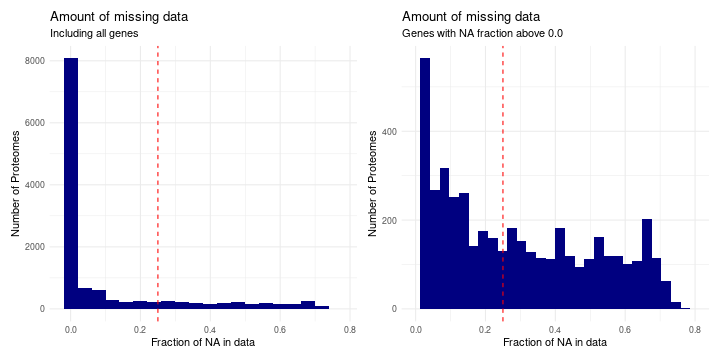
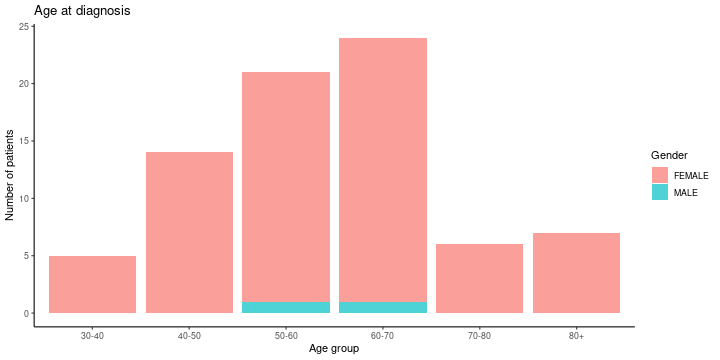
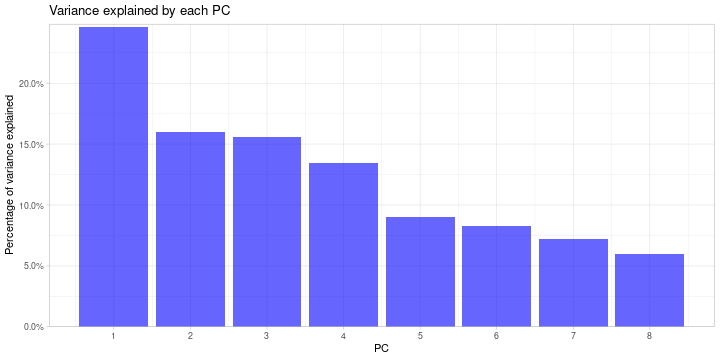

# Introduction 
## Overview of data
- Plots and other analysis of the data. 
- **File**: 77_cancer_proteomes_CPTAC_itraq.csv
  - Gene expression data from 77 cancer patients and 3 healthy persons.
- **File**: clinical_data_breast_cancer.csv
  - Clinical data from the 77 cancer patients
  
[Source: Kaggle](https://www.kaggle.com/piotrgrabo/breastcancerproteomes#clinical_data_breast_cancer.csv)  

## Github overview
#

# Materials and methods
## Materials: Extract of raw data

**Proteomes**
<table class="table" style="font-size: 10px; margin-left: auto; margin-right: auto;">
 <thead>
  <tr>
   <th style="text-align:left;"> RefSeq_accession_number </th>
   <th style="text-align:left;"> gene_symbol </th>
   <th style="text-align:left;"> gene_name </th>
   <th style="text-align:right;"> AO-A12D.01TCGA </th>
  </tr>
 </thead>
<tbody>
  <tr>
   <td style="text-align:left;"> NP_001615 </td>
   <td style="text-align:left;"> AIM1 </td>
   <td style="text-align:left;"> absent in melanoma 1 protein </td>
   <td style="text-align:right;"> -3.5403932 </td>
  </tr>
  <tr>
   <td style="text-align:left;"> NP_062559 </td>
   <td style="text-align:left;"> WDR45L </td>
   <td style="text-align:left;"> WD repeat domain phosphoinositide-interacting protein 3 </td>
   <td style="text-align:right;"> -1.6354941 </td>
  </tr>
  <tr>
   <td style="text-align:left;"> NP_001128727 </td>
   <td style="text-align:left;"> NA </td>
   <td style="text-align:left;"> histone-binding protein RBBP4 isoform b </td>
   <td style="text-align:right;"> -0.6144682 </td>
  </tr>
  <tr>
   <td style="text-align:left;"> NP_006321 </td>
   <td style="text-align:left;"> LYPLA1 </td>
   <td style="text-align:left;"> acyl-protein thioesterase 1 isoform 1 </td>
   <td style="text-align:right;"> -0.6449466 </td>
  </tr>
</tbody>
</table>

**Clinical**
<table class="table" style="font-size: 10px; margin-left: auto; margin-right: auto;">
 <thead>
  <tr>
   <th style="text-align:left;"> Complete TCGA ID </th>
   <th style="text-align:left;"> Gender </th>
   <th style="text-align:right;"> Age at Initial Pathologic Diagnosis </th>
   <th style="text-align:left;"> Tumor </th>
   <th style="text-align:left;"> PAM50 mRNA </th>
  </tr>
 </thead>
<tbody>
  <tr>
   <td style="text-align:left;"> TCGA-A2-A0T2 </td>
   <td style="text-align:left;"> FEMALE </td>
   <td style="text-align:right;"> 66 </td>
   <td style="text-align:left;"> T3 </td>
   <td style="text-align:left;"> Basal-like </td>
  </tr>
  <tr>
   <td style="text-align:left;"> TCGA-A2-A0CM </td>
   <td style="text-align:left;"> FEMALE </td>
   <td style="text-align:right;"> 40 </td>
   <td style="text-align:left;"> T2 </td>
   <td style="text-align:left;"> Basal-like </td>
  </tr>
  <tr>
   <td style="text-align:left;"> TCGA-BH-A18V </td>
   <td style="text-align:left;"> FEMALE </td>
   <td style="text-align:right;"> 48 </td>
   <td style="text-align:left;"> T2 </td>
   <td style="text-align:left;"> Basal-like </td>
  </tr>
  <tr>
   <td style="text-align:left;"> TCGA-BH-A18Q </td>
   <td style="text-align:left;"> FEMALE </td>
   <td style="text-align:right;"> 56 </td>
   <td style="text-align:left;"> T2 </td>
   <td style="text-align:left;"> Basal-like </td>
  </tr>
</tbody>
</table>

## Methods: Cleaning of data
### We have done some cleaning of the two data sets 
- **Proteomes**: 
  - Rename, so the column names align with the clinical file
  - Removing .01TCGA from every column name to match ID's in clinical using rename() in combination with str_replace_all()
  - Removing duplicates using select() 
  
- **Clinical**: 
  - Aligning ID's with proteome file using sub_str()

## Methods: Wrangle data
### After the cleaning, the datasets were wrangled and joined
- **Proteomes**: 
  - Removing fraction NA > 0.25 using filter()
  - Replace the remaining NAs with median of column
  - Transpose data (get RefSeqProteinID as columns)

- **Joining**:
  - Right_join by TCGA_IDs in proteomes file
    - 28 patients were dropped, 3 healthy patients
  - Age group, HER2 as binary, replace_na() in class

## Materials: Extract of clean data

**Joined data**
<table class="table" style="font-size: 10px; margin-left: auto; margin-right: auto;">
 <thead>
  <tr>
   <th style="text-align:left;"> TCGA_ID </th>
   <th style="text-align:left;"> Age_group </th>
   <th style="text-align:right;"> HER2_binary </th>
   <th style="text-align:left;"> Gender </th>
   <th style="text-align:left;"> Tumor </th>
   <th style="text-align:left;"> Class </th>
  </tr>
 </thead>
<tbody>
  <tr>
   <td style="text-align:left;"> AN-A0AM </td>
   <td style="text-align:left;"> 50-60 </td>
   <td style="text-align:right;"> 0 </td>
   <td style="text-align:left;"> FEMALE </td>
   <td style="text-align:left;"> T2 </td>
   <td style="text-align:left;"> Luminal B </td>
  </tr>
  <tr>
   <td style="text-align:left;"> A7-A0CJ </td>
   <td style="text-align:left;"> 50-60 </td>
   <td style="text-align:right;"> 0 </td>
   <td style="text-align:left;"> FEMALE </td>
   <td style="text-align:left;"> T2 </td>
   <td style="text-align:left;"> Luminal B </td>
  </tr>
  <tr>
   <td style="text-align:left;"> A2-A0SX </td>
   <td style="text-align:left;"> 40-50 </td>
   <td style="text-align:right;"> 0 </td>
   <td style="text-align:left;"> FEMALE </td>
   <td style="text-align:left;"> T1 </td>
   <td style="text-align:left;"> Basal-like </td>
  </tr>
  <tr>
   <td style="text-align:left;"> C8-A138 </td>
   <td style="text-align:left;"> 50-60 </td>
   <td style="text-align:right;"> 1 </td>
   <td style="text-align:left;"> FEMALE </td>
   <td style="text-align:left;"> T2 </td>
   <td style="text-align:left;"> HER2-enriched </td>
  </tr>
</tbody>
</table>

<table class="table" style="font-size: 10px; margin-left: auto; margin-right: auto;">
 <thead>
  <tr>
   <th style="text-align:right;"> NP_001449 </th>
   <th style="text-align:right;"> NP_001120959 </th>
   <th style="text-align:right;"> NP_003119 </th>
   <th style="text-align:right;"> NP_842565 </th>
   <th style="text-align:right;"> NP_001020029 </th>
   <th style="text-align:right;"> NP_008877 </th>
  </tr>
 </thead>
<tbody>
  <tr>
   <td style="text-align:right;"> -1.0036516 </td>
   <td style="text-align:right;"> -1.0036516 </td>
   <td style="text-align:right;"> 0.9220201 </td>
   <td style="text-align:right;"> 0.9479426 </td>
   <td style="text-align:right;"> 3.1550586 </td>
   <td style="text-align:right;"> 0.3998668 </td>
  </tr>
  <tr>
   <td style="text-align:right;"> -1.8598762 </td>
   <td style="text-align:right;"> -1.8598762 </td>
   <td style="text-align:right;"> -0.6348848 </td>
   <td style="text-align:right;"> -0.6875428 </td>
   <td style="text-align:right;"> -0.8704601 </td>
   <td style="text-align:right;"> -0.0833615 </td>
  </tr>
  <tr>
   <td style="text-align:right;"> 0.9544696 </td>
   <td style="text-align:right;"> 0.9578435 </td>
   <td style="text-align:right;"> 1.8148224 </td>
   <td style="text-align:right;"> 1.7912049 </td>
   <td style="text-align:right;"> -1.4039093 </td>
   <td style="text-align:right;"> -1.5658581 </td>
  </tr>
  <tr>
   <td style="text-align:right;"> 0.6144863 </td>
   <td style="text-align:right;"> 0.6144863 </td>
   <td style="text-align:right;"> 2.7887982 </td>
   <td style="text-align:right;"> 2.8495574 </td>
   <td style="text-align:right;"> 4.8849910 </td>
   <td style="text-align:right;"> -1.3471683 </td>
  </tr>
</tbody>
</table>

# Results
## Removal for genes according to the fraction of NAs

## Age at diagnosis

## Tumor, age at diagnosis and gender

## Subtype of breast cancer

## Extract relevant breast cancer genes

8 genes are selected \
- BRCA1 = breast cancer type 1 susceptibility protein isoform 2 \
- TP53 = cellular tumor antigen p53 isoform a \
- CHEK2 = serine/threonine-protein kinase Chk2 isoform a \
- PTEN = phosphatidylinositol 3,4,5-trisphosphate 3-phosphatase \
- CDH1 = cadherin-1 preproprotein \
- STK11 = serine/threonine-protein kinase STK11 \
- ERRB2 / HER2 = receptor tyrosine-protein kinase erbB-2 isoform a precursor \
- GATA3 = trans-acting T-cell-specific transcription factor GATA-3 isoform 1\

## Heat map

## PCA percent

## PCA and K-means

## Linear model extract

<table class="table" style="font-size: 10px; margin-left: auto; margin-right: auto;">
 <thead>
  <tr>
   <th style="text-align:left;"> RefSeqProteinID </th>
   <th style="text-align:right;"> p.value </th>
   <th style="text-align:right;"> conf.low </th>
   <th style="text-align:right;"> conf.high </th>
   <th style="text-align:left;"> identified_as </th>
   <th style="text-align:right;"> neg_log10_p </th>
  </tr>
 </thead>
<tbody>
  <tr>
   <td style="text-align:left;"> NP_009115 </td>
   <td style="text-align:right;"> 0.0076435 </td>
   <td style="text-align:right;"> -1.9185586 </td>
   <td style="text-align:right;"> -0.3251956 </td>
   <td style="text-align:left;"> Significant </td>
   <td style="text-align:right;"> 2.116706 </td>
  </tr>
  <tr>
   <td style="text-align:left;"> NP_659489 </td>
   <td style="text-align:right;"> 0.0043693 </td>
   <td style="text-align:right;"> -1.6699737 </td>
   <td style="text-align:right;"> -0.3386206 </td>
   <td style="text-align:left;"> Significant </td>
   <td style="text-align:right;"> 2.359587 </td>
  </tr>
  <tr>
   <td style="text-align:left;"> NP_002078 </td>
   <td style="text-align:right;"> 0.0074028 </td>
   <td style="text-align:right;"> -0.9892919 </td>
   <td style="text-align:right;"> -0.1772664 </td>
   <td style="text-align:left;"> Significant </td>
   <td style="text-align:right;"> 2.130604 </td>
  </tr>
  <tr>
   <td style="text-align:left;"> NP_003746 </td>
   <td style="text-align:right;"> 0.0225195 </td>
   <td style="text-align:right;"> -2.2574757 </td>
   <td style="text-align:right;"> -0.2291550 </td>
   <td style="text-align:left;"> Significant </td>
   <td style="text-align:right;"> 1.647442 </td>
  </tr>
</tbody>
</table>

## Manhattan plot

## Confidence interval plots

# Discussion
## Handling of NA values
- Limit at 25% ~ 17% genes removed \
- Limit at 0% ~ 36% genes removed \

### Replacement by median**\
- Avoid NA values \
\
- Not necessary to remove either person or whole gene \
\
- Does not skew the data\

## Selection of cancer genes
- Small subset of data \
- Improvement for future: identify significant genes across whole dataset\
- Findings: HER2/ERRB2 gene significant in Manhattan plot

## Additional thoughts

### Comparison between healthy and diseased \
- Used in PCA analysis and K-means \
- Only 3 individuals (no clinical data) \
\

### Deselection of dataset \
- "Dictionary" of proteins \
- Not usefull for our approach \
- Could have been used to "translate" RefSeqProteinID's

# Thank you for listening 
